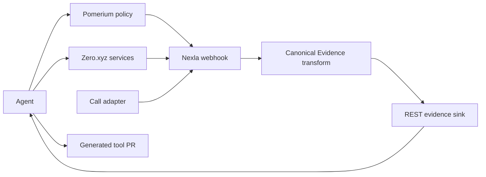

# PitchLoop

PitchLoop is a consent-gated sales agent that acquires and authors missing evidence tools before retrying a paid call.

## Problem and insight

Most self-improving agents rewrite prompts. PitchLoop improves its toolset: a failed call identifies a missing evidence claim, the agent searches Zero.xyz, authors one constrained tool when no service matches, tests and merges it, then retries the same action.

## Deterministic scenario

PitchLoop sells the fictional MigrationGuard product to fictional Northstar Systems. `alex_rivera` is denied by policy and is never called. Consenting teammate `maya_chen` receives two calls governed by one deterministic rubric: Call 1 contains Fact A but lacks only Fact B; Call 2 contains both and books a meeting.

## Autonomous loop

Specification → plan → Pomerium deny/allow → Zero discovery and paid Fact A → Call 1 → Nexla-normalized diagnosis → Zero Fact B no-match → generated tool and conformance → GitHub PR merge → registry reload → Fact B → Call 2.

## Architecture



## Why the integrations are causal

- Zero.xyz supplies the paid enrichment and call outcomes; the agent searches its live catalog before authoring a missing tool.
- Pomerium produces a real denial for the non-consenting contact and an allow for the consenting contact. The denial is never bypassed.
- Nexla is the live normalization and read path used for diagnosis; live mode cannot normalize locally or read raw files.

## Run locally

Requires Python 3.12.

```bash
python3.12 -m venv .venv
.venv/bin/pip install -e '.[dev]'
.venv/bin/pytest -q
cp .env.example .env
demo/run_demo.sh
```

## Live configuration

Set the environment variables listed in `.env.example`. For Nexla, expose the local sink with ngrok, configure one webhook → transform → REST destination flow, then set `NEXLA_SERVICE_KEY`, `NEXLA_INGRESS_URL`, `NEXLA_FLOW_ID`, and the public `NEXLA_SINK_URL`. Never commit their values.

## Proof artifacts

The integrated fake demo writes each run under `runs/fake-demo.*`; 88 tests pass and the loop reaches `MEETING_BOOKED`. Nexla lineage, paid receipts, Pomerium responses, calls, and the generated-tool PR remain live-run artifacts and must not be represented as complete until captured.

## Generated-tool PR

Pending the live autonomous run. The generated tool is restricted to `fact_b` and must pass the fixed conformance suite before merge.

## Limitations and ethics

This hackathon build supports one fictional company, one consenting callee, two calls, and one generated tool. It has no dashboard, arbitrary outreach, calendar integration, or policy bypass. Phone numbers, credentials, and unredacted receipts are excluded from Git.

## Team

- P1: contracts, agent loop, and Zero adapter
- P2: scenario, pitch, call adapter, fixture, and conformance
- P3: Pomerium and GitHub adapters
- P4: Nexla evidence path, integration, and release

## Hackathon requirement matrix

| Requirement | Proof |
|---|---|
| Read specification and plan | `runs/demo-001/spec.json`, `plan.json` |
| Real policy denial and allow | `policy/deny.json`, `policy/allow.json` |
| Runtime discovery and paid action | `zero/search_fact_a.json`, receipts |
| Diagnose missing capability | Nexla-normalized evidence and `evidence/diagnosis.json` |
| Author, test, and merge tool | conformance result and generated-tool PR |
| Reload and improve result | Fact B evidence and booked Call 2 artifact |
