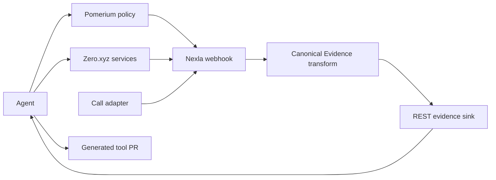

# PitchLoop

PitchLoop is a consent-gated small-business website sales agent that researches a queue, learns across owner conversations, and acquires or authors missing research tools.

## Problem and insight

Most self-improving agents rewrite prompts. PitchLoop records an evidence-backed reflection after every call, updates the campaign strategy for the next person, and grows its toolset when a missing capability blocks progress.

## Deterministic scenario

PitchLoop sells SiteSpring's website-building service to fictional local businesses. Zero.xyz discovers the queue and researches each business. `alex_rivera` is denied by policy and is never called. Each eligible owner is called at most once; Nina exposes a missing website-audit capability, later owners surface value, proof, friction, and timing objections, and the accumulated strategy eventually books Derek.

## Autonomous loop

Goal → Zero prospect discovery → ordered queue → policy → tool assessment → business research → one call → normalized diagnosis → reflection → strategy/tool improvement → next uncalled owner → qualified meeting.

## Architecture



## Why the integrations are causal

- Zero.xyz discovers prospects, supplies business research, and places calls; the agent searches its catalog before authoring the missing website-opportunity audit.
- Pomerium produces a real denial for the non-consenting contact and an allow for the consenting contact. The denial is never bypassed.
- Nexla is the live normalization and read path used for diagnosis; live mode cannot normalize locally or read raw files.

## Run locally

Requires Python 3.12.

```bash
python3.12 -m venv .venv
.venv/bin/pip install -e '.[dev]'
.venv/bin/pytest -q
cp .env.example .env
demo/run_demo.sh
```

## Visual demo

```bash
.venv/bin/python -m demo.ui
```

Open `http://127.0.0.1:8000`, enter a natural-language campaign objective, and
launch the fake/local campaign. The desktop dashboard refreshes while the agent
works and exposes the ordered queue, campaign statistics, every business and call, reflections,
strategy changes, Zero.xyz and custom tools, evidence, receipts, transcripts, and the
append-only agent action history. Click a completed call to inspect its full
record; use the campaign picker to revisit prior runs.

## Live configuration

Set the environment variables listed in `.env.example`. In live-call mode, every fictional queue entry is routed by Zero.xyz to the same consented teammate number in `CALLEE_PHONE_E164`; candidate IDs choose only the demo persona and evidence. No prospect phone list exists. For Nexla, expose the local sink with ngrok, configure one webhook → transform → REST destination flow, then set `NEXLA_SERVICE_KEY`, `NEXLA_INGRESS_URL`, `NEXLA_FLOW_ID`, and the public `NEXLA_SINK_URL`. Never commit values.

## Proof artifacts

The integrated fake demo writes each run under `runs/fake-demo.*` or `runs/campaign-*` and reaches `MEETING_BOOKED`. Nexla lineage, paid receipts, Pomerium responses, calls, and the generated-tool PR remain live-run artifacts and must not be represented as complete until captured.

## Generated-tool PR

Pending the live autonomous run. The generated website opportunity audit retains the frozen internal `fact_b` contract and must pass conformance before merge.

## Limitations and ethics

This hackathon build supports a fictional local-business cohort, a deterministic desktop campaign, and one generated capability. Live calling is deliberately limited to one configured, consented teammate number even though the queue shows multiple personas. It has no arbitrary outreach, calendar integration, or policy bypass. Phone numbers, credentials, and unredacted receipts are excluded from Git.

## Team

- P1: contracts, agent loop, and Zero adapter
- P2: scenario, pitch, call adapter, fixture, and conformance
- P3: Pomerium and GitHub adapters
- P4: Nexla evidence path, integration, and release

## Hackathon requirement matrix

| Requirement | Proof |
|---|---|
| Read specification and plan | `runs/demo-001/spec.json`, `plan.json` |
| Real policy denial and allow | `policy/deny.json`, `policy/allow.json` |
| Runtime discovery and paid action | `zero/search_fact_a.json`, receipts |
| Diagnose missing capability | Nexla-normalized evidence and `evidence/diagnosis.json` |
| Author, test, and merge tool | conformance result and generated-tool PR |
| Reload and improve later calls | Tool reuse, strategy versions, reflection receipts, and the booked meeting artifact |
