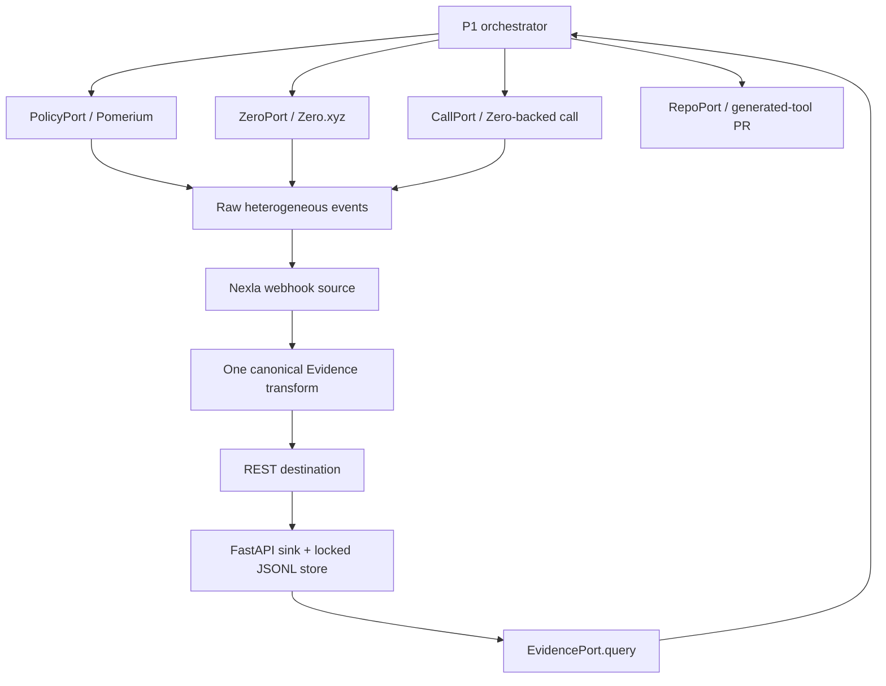

# Architecture

PitchLoop is a synchronous state loop around frozen ports. Each external response is persisted raw, normalized through Nexla when live, and read back as validated `Evidence` before diagnosis advances.

Local mode uses the same deterministic normalization function for tests. Live mode has no local fallback: ingress, transformation, and sink delivery must succeed or the run records an explicit failure.

P1 may also publish an Evidence-shaped payload without `evidence_id`; the same transform preserves its fields and adds a stable ID plus correlation provenance.

## Evidence mapping

| Raw type | Kind | Claim | Stable ID |
|---|---|---|---|
| `policy.decision` | `policy` | `contact_allowed` or `contact_denied` | `ev_policy_<correlation>` |
| `zero.paid_result` | `enrichment` | `fact_a` | `ev_zero_<correlation>` |
| `call.completed` | `call` | `call_outcome` | `ev_call_<correlation>` |
| `tool.result` | `tool` | `fact_b` | `ev_tool_<correlation>` |
